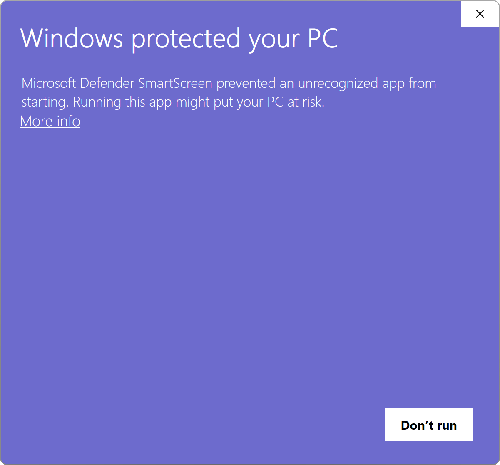
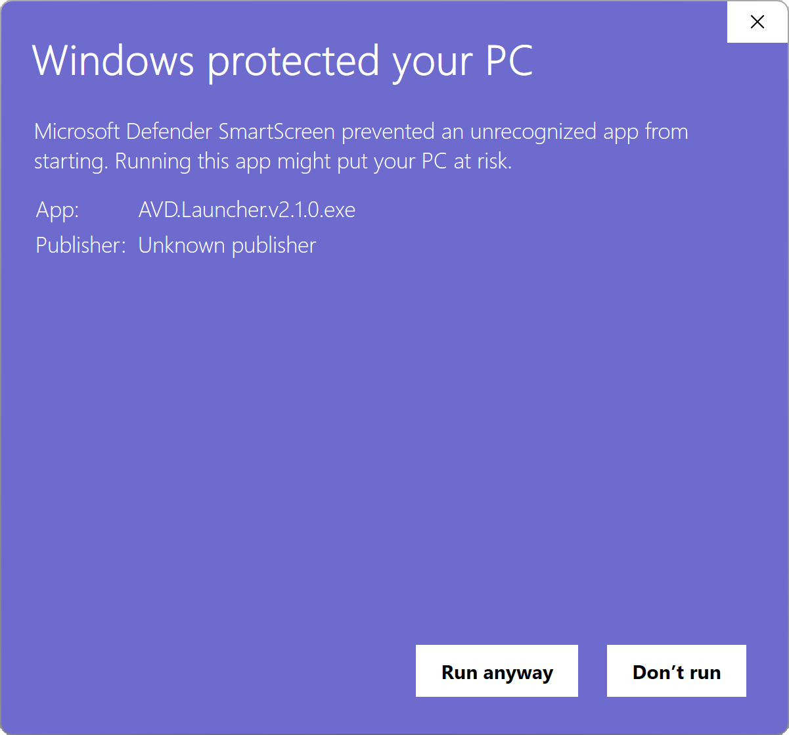

<div align="center">
  <a href='' target="_blank">
    
  </a>
  <h1>AVD Launcher</h1>
</div>

- ⚡ AVD Launcher — a very simple Android Virtual Devices manager 
- Cross-platform, portable, and minimal

<br/>

<div align="center">
  
</div>

## 📥 Downloads
- Grab the latest version for your platform from the [**Releases page**](https://github.com/symonxdd/avd-launcher/releases/latest).  
- No install required — just download and run!

> [!TIP]
> GitHub 'Releases' is GitHub jargon for downloads.

<br/>

<details>
<summary>
<strong>⚠️ What's the "Windows protected your PC" message?</strong>
</summary>

### ⚠️ Windows SmartScreen Warning
When you run the app for the first time on Windows, you might see a warning like this:

<div>
  
  <br/><br/>
  
</div>

### 🧠 What's actually happening?

This warning appears because the app is **new** and **hasn't yet built trust** with Microsoft SmartScreen, **not because the app is malicious**.

According to [Microsoft's official documentation](https://learn.microsoft.com/en-us/windows/security/operating-system-security/virus-and-threat-protection/microsoft-defender-smartscreen/), SmartScreen determines whether to show this warning based on:

- Whether the file matches a **known list of malicious apps** or is from a **known malicious site**
- Whether the file is **well-known and frequently downloaded**
- Whether the app is **digitally signed** with a costly trusted certificate

This is **just a generic warning** — many indie or open-source apps trigger it until they build trust or pay for expensive certificates.

### ✅ How to dismiss and run

1. Click **"More info"**
2. Click **"Run anyway"**

That’s it — the app will start normally.

### 🤨 Why not prevent the warning

To fully avoid SmartScreen warnings on Windows, developers are expected to:

- Buy and use an **EV (Extended Validation) Code Signing Certificate**  
- Have enough users download the app over time to build a strong **reputation score**

These certificates can cost **hundreds of dollars per year**, which isn't always feasible for solo developers or small open-source projects.  
We're focused on keeping this tool free and accessible.  
> For full details on how SmartScreen works, check out [Microsoft's official documentation](https://learn.microsoft.com/en-us/windows/security/operating-system-security/virus-and-threat-protection/microsoft-defender-smartscreen/)

Thanks for supporting open-source tools! 💙

</details>

<br/>

## 💡 Motivation
I'm always excited to try out new technologies, and this project was a perfect opportunity to dive into something fresh. This is my first time working with **Go** and **Wails**.

As someone who occasionally develops for mobile, I've always found myself needing a simple tool to quickly launch Android Virtual Devices (AVDs) without the overhead of opening Android Studio. This need became even more apparent during my college internship, where I spent a lot of time working with AVDs but was frustrated by the process of launching Android Studio just to start an emulator. That’s when the idea for **AVD Launcher** came to life.

Wails provides a fantastic bridge between the frontend (Vue.js) and Go’s powerful backend, and I loved how easy it was to get started. There were challenges along the way, but each hurdle made the project that much more rewarding. The integration of both languages felt natural, and I quickly found myself enjoying the process.

<br/>

## 📸 Screens  

### Main


<br/>

### Logs


<br/>

### Settings
 

<br/>

### ANDROID_HOME not set
 

<br/>

> [!NOTE]
> **Developer section below:** The following content is intended for developers interested in the inner workings of AVD Launcher.

<br/>

## 🗂️ Project Layout
Here's a quick overview of the main files and folders:
```
avd-launcher/
├── .github/
│   └── workflows/
│       └── release.yml         # GitHub Actions workflow for cross-platform builds + releases
│
├── app/                        # Go backend logic
│   ├── helper/                 # Cross-platform utilities and command wrappers
│   │   ├── command_default.go  # Default command runner (used on non-Windows)
│   │   ├── command_windows.go  # Windows-specific command runner (hides terminal window)
│   │   └── helper.go           # Utilities for resolving paths, logging, ADB helpers, etc.
│   ├── models/                 # Data structures like the AVD model
│   ├── app.go                  # Main backend bindings exposed to the frontend
│   └── avd_manager.go          # Functions for managing AVDs (start, list, etc.)
│
├── build/                      # App icons, packaging resources, and Wails build outputs
│   └── appicon.png             # Icon used for the app window and release packages
│
├── frontend/                   # Vue 3 frontend (served with Vite)
│   ├── src/
│   │   ├── main.js             # Vue app entry point
│   │   └── App.vue             # Root Vue component
│   └── index.html              # HTML entry point
│
├── go.mod                      # Go dependencies (the Go module manifest)
├── go.sum                      # Go dependency checksums
├── main.go                     # App entry point (launches Wails)
├── release.js                  # Script to automate version bumping and pushing a new release
├── wails.json                  # Wails project configuration
└── README.md                   # You're reading it ✨
```

> [!NOTE]
> The two files at `app/helper/command_*.go` are **OS-specific** and use [Go build tags](https://pkg.go.dev/go/build#hdr-Build_Constraints) to automatically select the correct one during build time. This ensures clean handling of platform quirks without any runtime checks.

<br/>

## 🔧 Dev Prerequisites
- To build or run in live dev mode, follow the [official Wails installation guide](https://wails.io/docs/gettingstarted/installation).  
- You'll need Go installed, along with Node and a package manager like `npm`, `yarn`, or `pnpm`.
<br/><br/>

## ⚙️ Live Development
To start the app in live development mode:
```bash
wails dev
```
This runs a Vite-powered dev server with hot reload for the frontend.
<br/><br/>

## 📦 Release Build
To generate a production-ready, standalone binary:
```bash
wails build
```
This compiles the app and outputs a native executable, ready to distribute.
<br/><br/>

## 🚀 Release Workflow

AVD Launcher uses a fully automated release pipeline powered by **GitHub Actions** and a helper script.

To create a new release, run the release script:
```bash
npm run release
```

This will:

1. Prompt to select the version type (`Patch`, `Minor`, or `Major`)
2. Bump the version in `frontend/package.json`
3. Commit the version bump and create a Git tag
4. Push the commit and tag to GitHub

> [!NOTE]
> The version bump uses a clear commit message like: `chore: bumped version to v1.2.3`

When a `v*` tag is pushed, the [`release.yml`](.github/workflows/release.yml) GitHub Actions workflow is triggered.

- 🔧 Builds native binaries for:
  - Linux (amd64)
  - Windows (.exe)
  - macOS (.pkg)
- 🗃 Renames and organizes the build artifacts.
- 📝 Creates a new GitHub Release and uploads the binaries with OS-specific labels.

💡 The release process can be viewed under the repo's **Actions** tab

> [!TIP]
> _This release pipeline wasn't built overnight — it took a full day of trial, error, and frustration to get it working just right. If you're struggling to set up something similar, you're not alone!_

## Built with ❤️
This project is built with passion using:
- [Wails](https://wails.io/)
- [Go](https://go.dev/)
- [Vue 3](https://vuejs.org/)

<div align="center">
  <sub>Made with 💜 by Symon from Belgium</sub>
</div>
<div align="center">
  <sub>Powered by <a href="https://wails.io/">Wails</a></sub>
</div>
